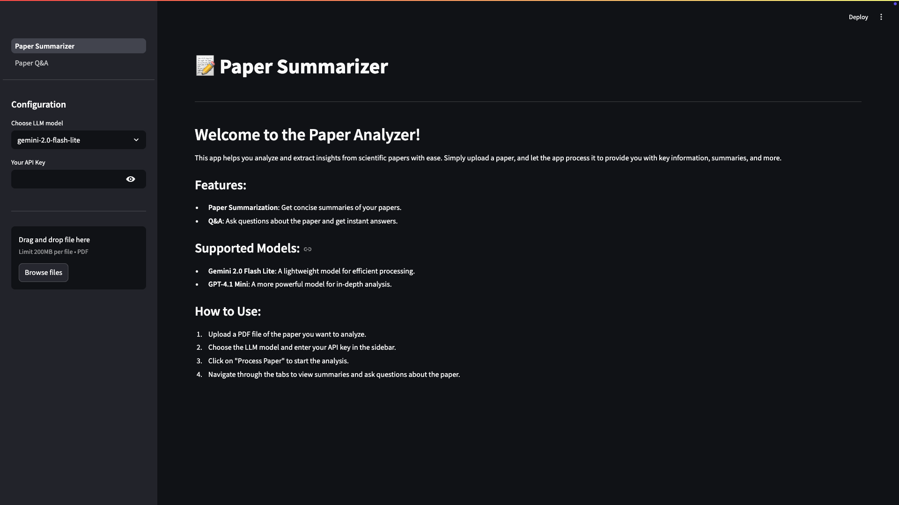
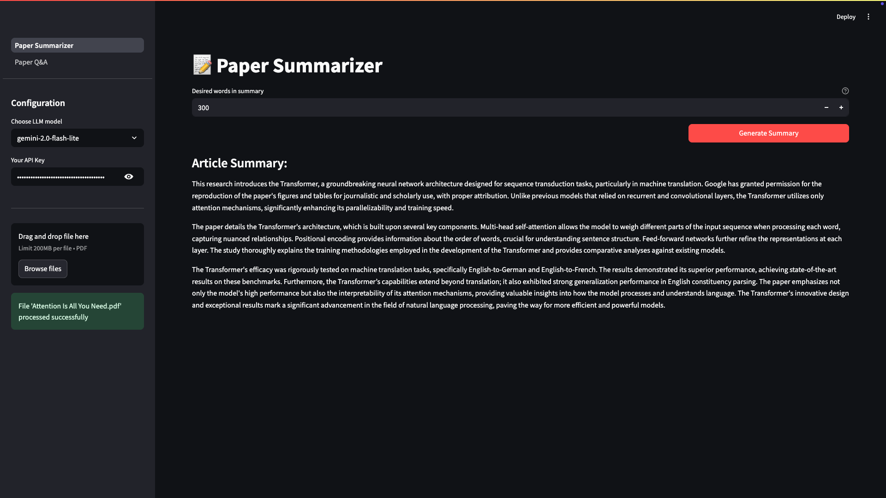
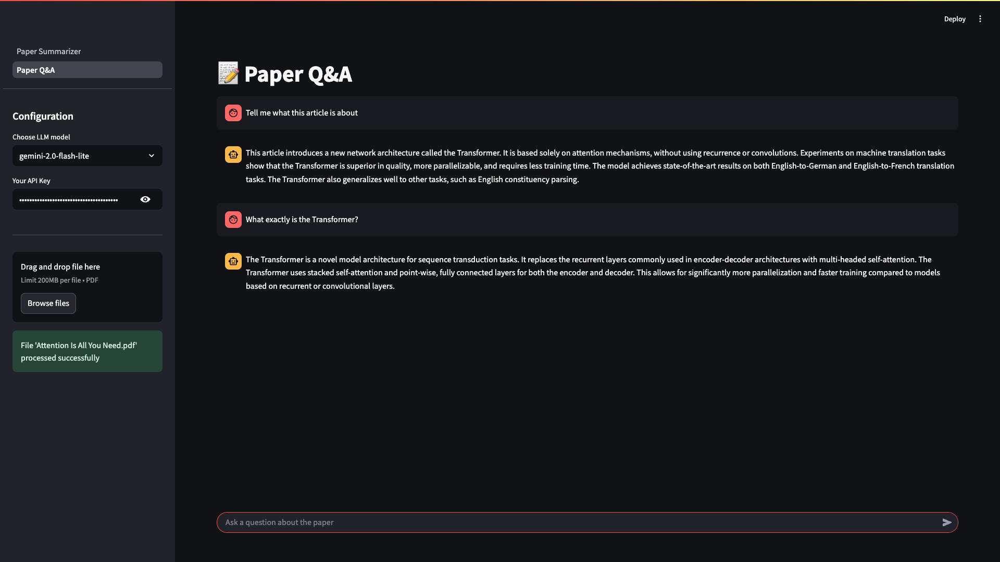

# Paper Summarizer & Analyzer 📝

[](https://www.python.org/downloads/release/python-3130/)
[](https://opensource.org/licenses/MIT)
[](https://streamlit.io)
[](https://www.langchain.com/)
[](https://huggingface.co/transformers/)
[](https://pytorch.org/)
[](https://faiss.ai/)
[](https://github.com/VikParuchuri/marker)


## Overview

The **Paper Summarizer & Analyzer** is a tool designed to help users quickly understand and interact with scientific papers. By uploading a PDF document, users can generate concise summaries tailored to a desired length and engage in a question-answering session about the paper's content. The application leverages state-of-the-art Large Language Models (LLMs) and text processing techniques to provide insightful analysis.

## Features

* **📄 PDF Processing:** Upload scientific papers in PDF format for analysis.
* **📜 Text Extraction:** Efficiently extracts text from PDF documents using the `marker-pdf-parser` library.
* **✂️ Intelligent Chunking:** Splits extracted text into manageable chunks optimized for LLM processing, using a recursive character splitter and Hugging Face tokenizers.
* **✨ Semantic Embeddings:** Generates dense vector embeddings for text chunks using sophisticated models like `Lajavaness/bilingual-embedding-large` to capture semantic meaning. (Evaluation results for different embedding models can be found in `results/embedding_model_evaluation_results.json`).
* **🔍 Vector Storage & Retrieval:** Utilizes FAISS for efficient similarity search and retrieval of relevant text chunks for Q&A.
* **✍️ Customizable Summaries:** Generates abstractive summaries of uploaded papers, allowing users to specify the desired word count. (Evaluation results for summaries generated by different LLMs can be found in `results/summary_evaluation_results.json`).
* **💬 Interactive Q&A:** Ask questions about the paper's content and receive answers generated by an LLM, supported by retrieved context from the document (Retrieval Augmented Generation - RAG).
* **🤖 Multi-LLM Support:** Choose between different powerful LLMs for summarization and Q&A, including:
    * `gemini-2.0-flash-lite` (Google)
    * `gpt-4.1-mini` (OpenAI)
* **🌐 Web Interface:** User-friendly web application built with Streamlit for easy interaction.
* **🧠 Efficient Model Loading:** Utilizes a singleton pattern for resource-intensive models like embedding and PDF extraction to ensure they are loaded only once, optimizing performance and memory usage.

## Solution Architecture

The application follows a multi-step process to analyze and interact with research papers:

1.  **PDF Upload & Text Extraction:** The user uploads a PDF file through the Streamlit interface. The `MarkerTextExtractor` then processes the PDF to extract its textual content.
2.  **Text Preprocessing & Chunking:** The extracted text is segmented into smaller, overlapping chunks using `RecursiveCharacterTextSplitter`. This is crucial for fitting the context within the LLM's token limits. Chunk size and overlap are configurable (default: 512 tokens chunk size, 64 tokens overlap).
3.  **Embedding Generation & Vector Storage:** Each text chunk is converted into a numerical vector (embedding) using a pre-trained sentence transformer model (`Lajavaness/bilingual-embedding-large` by default). These embeddings are stored in a FAISS vector store for efficient similarity searching.
4.  **Summarization:**
    * The full extracted text is provided to a Langchain `load_summarize_chain` (using a `map_reduce` strategy).
    * The user specifies the desired summary length, and the selected LLM (Gemini or GPT) generates a concise summary based on a custom prompt designed to highlight key findings and contributions.
5.  **Question Answering (RAG):**
    * When a user asks a question, the system embeds the question and queries the FAISS vector store to retrieve the most relevant text chunks (K_RETRIEVED_DOCS = 5 by default).
    * These retrieved chunks, along with the original question, are fed into the selected LLM using a LangGraph-powered Q&A graph and a specific RAG prompt.
    * The LLM generates an answer based on the provided context. Chat history is maintained in conversations.

## Technologies Used

* **Programming Language:** Python 3.13
* **Core Framework:**
    * [Streamlit](https://streamlit.io/): For building the interactive web application.
    * [Langchain](https://www.langchain.com/): For LLM interaction, text processing (splitting, vector stores), prompt management, and agentic workflows (Q&A graph).
* **LLMs & Embeddings:**
    * Google Gemini models (e.g., `gemini-2.0-flash-lite`) via `langchain-google-genai`.
    * OpenAI GPT models (e.g., `gpt-4.1-mini`) via `langchain-openai`.
    * Hugging Face Sentence Transformers for embeddings (e.g., `Lajavaness/bilingual-embedding-large`) via `langchain-huggingface`.
* **Text & Data Processing:**
    * `marker-pdf-parser`: For robust PDF text extraction.
    * `FAISS`: For efficient similarity search in vector stores.
    * `transformers` (Hugging Face): For tokenization.
    * `PyTorch`: As a backend for sentence transformers and device (CPU/GPU/MPS) management.
* **Experimentation & Evaluation:**
    * Scripts for downloading papers, converting to markdown, chunking, generating summaries, and evaluating embedding models and summaries are available in the `experiments/` directory.
    * Metrics: ROUGE, BLEU, BERTScore for summaries; MRR, Recall@K for embeddings.

## Installation

1.  **Clone the repository:**
    ```bash
    git clone https://github.com/danmac423/paper-summarizer.git
    cd paper-summarizer
    ```

2.  **Create a virtual environment and install dependencies:**
    ```bash
    make venv
    source .venv/bin/activate
    ```

## Running the Application

Once the setup is complete, run the Streamlit application:
```bash
make run
```

## Usage

1.  **Configure LLM:**
    * Select the LLM model you want to use (e.g., `gemini-2.0-flash-lite`, `gpt-4.1-mini`) from the sidebar.
    * Enter your API key for the selected LLM service in the sidebar if not set as an environment variable.

2.  **Upload & Process Paper:**
    * Upload a PDF of the scientific paper you want to analyze using the file uploader in the sidebar.
    * Click the "Process Paper" button. Processing involves text extraction, chunking, and embedding generation, which might take some time depending on the paper's length and your hardware.

3.  **Generate Summary:**
    * Once the paper is processed, the "Paper Summarizer" page will allow you to generate a summary.
    * Enter the desired number of words for the summary.
    * Click "Generate Summary". The summary will appear below.

4.  **Ask Questions (Paper Q&A):**
    * Navigate to the "Paper Q&A" page from the sidebar/menu (this page is defined in `src/web_ui/pages/1_Paper_Q&A.py`).
    * Type your question about the processed paper in the chat input box at the bottom.
    * The system will retrieve relevant context from the paper and generate an answer using the selected LLM. Your conversation history will be displayed.

## Screenshots

### Main Interface


### Paper Summarizer


### Paper Q&A


## To-Do / Future Enhancements

* Implement more robust error handling and user feedback in the UI.
* Add support for more document formats (e.g., .txt, .docx).
* Explore more advanced RAG techniques (e.g., re-ranking, query transformation).
* Allow users to select different embedding models from the UI.
* Implement caching for processed documents to speed up repeated analysis.
* Add more detailed evaluation metrics and visualizations.
* Package as a Docker container for easier deployment.

